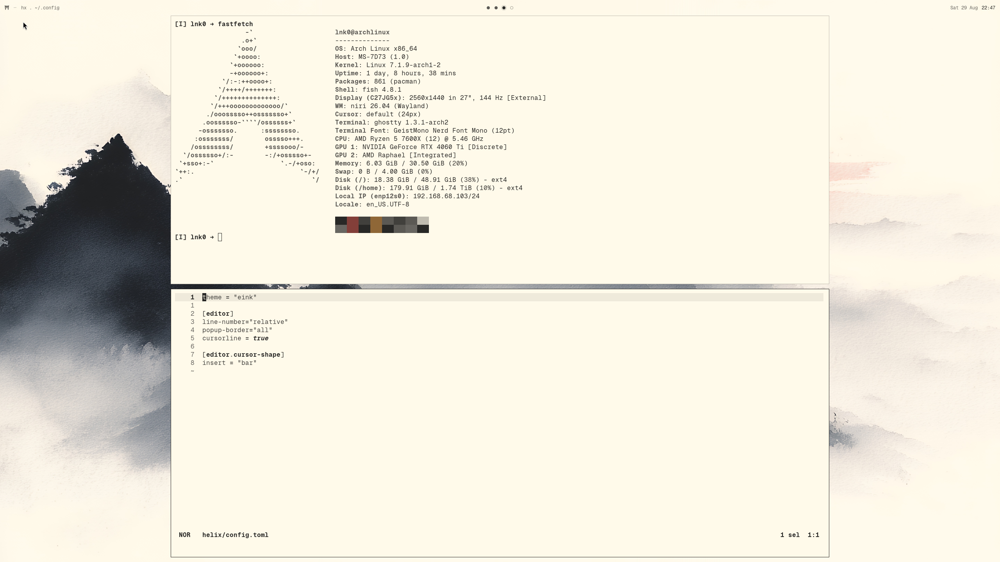

# dotfiles



`~/.config` for an Arch + Wayland machine. Niri, fish, Helix, Ghostty — all on one
e-ink-inspired palette generated from a single file.

## Layout

| | |
|---|---|
| `theme/` | the palette and its build script — **start here**, see `theme/README.md` |
| `niri/` `waybar/` `mako/` `jay/` | Wayland compositor, bar, notifications |
| `fish/` | shell: config, functions, completions |
| `helix/` `ghostty/` | editor and terminal, with themes |
| `yazi/` `btop/` `glow/` `lazygit/` `hunk/` `spotify-player/` | TUI tools |
| `glide/` | Glide browser config (TypeScript); the profile is not tracked |
| `systemd/user/` | user units, plus the `.wants` symlinks recording what is enabled |
| `wireplumber/` `environment.d/` | audio codecs, NVIDIA offload |

## Setup on a new machine

`~/.config` already exists on a fresh install, so `git clone` into it directly
will refuse. Attach a repo to the existing directory instead:

```fish
cd ~/.config
git init -b main
git remote add origin git@github.com:lnk00/dotfiles.git
git fetch origin
git checkout -f main                  # -f: overwrite the distro defaults
git config core.hooksPath .githooks   # hooks are never cloned; per-clone setup
systemctl --user daemon-reload
python3 theme/build.py --check        # 37 targets, 0 needing attention
```

`checkout -f` overwrites any `~/.config` file this repo tracks and leaves
everything else alone. Run `git checkout main` first without `-f` if you want
to see what it would clobber.

## The theme system

One palette in `theme/eink.toml` renders into 47 targets across fifteen
applications. Edit that file, then `python3 theme/build.py`. Never hand-edit a
generated file — the next build overwrites it.

The `pre-commit` hook runs `theme/build.py --check` and refuses a commit if any
generated file has drifted. Bypass once with `git commit --no-verify`.

`*.pre-eink` files are the untouched originals from before the palette was
applied, kept as the per-app revert path. `theme/README.md` explains the rest.

## What is deliberately not tracked

`.gitignore` is **deny-by-default**: everything is ignored, and each config is
opted in explicitly. A newly installed app drops its files into `~/.config`
without ever appearing in `git status`.

To add a new config, un-ignore the directory *and* its contents:

```gitignore
!/foo/
!/foo/**
```

A negation cannot re-include a file whose parent directory is still ignored —
that is why every entry comes in pairs. Check the result before committing:

```fish
git add -A --dry-run
```
